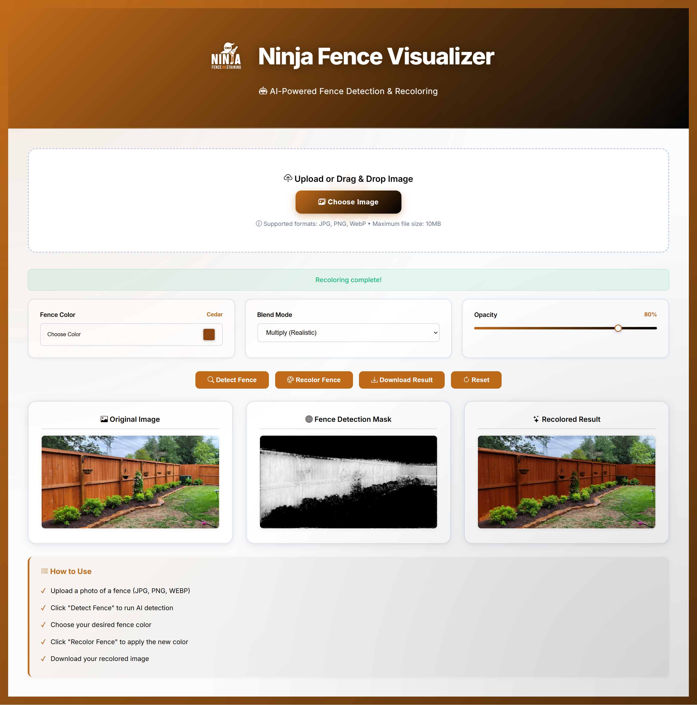
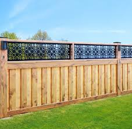
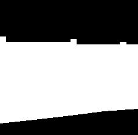

# Ninja Fence Staining Visualizer - AI-Powered Fence Detection & Recoloring

[](https://opensource.org/licenses/MIT)
[](https://chanderbhanswami.github.io/fence-staining-visualizer/)
[](https://github.com/chanderbhanswami/fence-staining-visualizer/stargazers)
[](https://github.com/chanderbhanswami/fence-staining-visualizer/issues)
[](https://www.python.org/downloads/)
[](https://pytorch.org/)

**Transform fence visualization with AI-powered semantic segmentation**

A production-ready web application that uses deep learning (UNet++ architecture) to automatically detect fences in photos and apply realistic color transformations.

---

## Overview

This tool leverages advanced computer vision to:
- **Automatically detect** fences in uploaded images
- **Precisely segment** fence areas using UNet++ deep learning
- **Realistically recolor** fences with customizable stain colors
- **Process instantly** in the browser (client-side, privacy-friendly)

## User Interface



## Visual Example

**Input Image:**



**Detection Mask (AI-Generated):**



The AI model identifies fence structures with pixel-level precision, even handling complex scenes with vegetation, shadows, and various fence styles.

---

## Key Features

### AI-Powered Detection
- **UNet++ Architecture**: State-of-the-art segmentation model with EfficientNet-B7 encoder
- **512×512 Resolution**: High-quality detection with fine edge details
- **ONNX Runtime**: Optimized browser inference (fast, efficient)
- **Deep Supervision**: Multi-level feature fusion for accurate boundaries

### Advanced Recoloring
- **Multiple Blend Modes**: Multiply, Overlay, Screen, Normal
- **Adjustable Opacity**: 0-100% for subtle to dramatic effects
- **Edge Smoothing**: 5 levels (None to Maximum) for natural transitions
- **Real-time Preview**: Instant visual feedback

### Professional Controls
- **Detection Threshold**: Fine-tune sensitivity (0.1-0.9)
- **Custom Color Picker**: 20 predefined professional stain colors (Cedar, Mahogany, Walnut, Oak, Cherry, Pine, Redwood, Espresso, Driftwood, Hickory, Chestnut, Teak, Ebony, Maple, Natural, Gray, Charcoal, White Oak, Rustic, Slate)
- **Modal Color Selection**: Elegant popup dialog for color selection without layout shifts
- **High-Quality Output**: Download results in PNG format
- **Responsive Design**: Works on desktop, tablet, and mobile

### Privacy & Performance
- **100% Client-Side**: No server uploads, all processing in-browser
- **Offline Capable**: Works after initial model load
- **No Data Collection**: Your images never leave your device
- **Fast Processing**: GPU-accelerated when available

---

## UI/UX Features

### Modern & Intuitive Interface
- **Brand-Specific Color Theme**: Custom orange (#C06B1A) and black gradient design
- **Animated Gradient Background**: Dynamic shifting background with floating effects
- **Smooth Animations**: Fade-in, slide-in, and hover effects throughout
- **Professional Typography**: Inter font family for clean, modern look

### Responsive & Device-Friendly
- **Fully Responsive**: Optimized layouts for desktop, tablet, and mobile devices
- **Touch-Friendly**: Large tap targets and mobile-optimized controls
- **Adaptive Grid**: Control panels automatically adjust to screen size
- **Mobile-First Design**: Works seamlessly on smartphones and tablets

### Advanced Upload System
- **Drag & Drop**: Simply drag images directly into the upload area
- **Click to Upload**: Traditional file picker for easy access
- **Multiple Format Support**: JPG, PNG, WebP images accepted
- **File Size Limit**: Up to 10MB per image
- **Visual Upload States**: Hover and drag-over animations for feedback
- **Upload Icons**: Bootstrap Icons for clear visual communication

### Custom Color Picker
- **Modal Dialog**: Beautiful popup with backdrop blur effect
- **20 Professional Colors**: Curated wood stain colors with names
- **5-Column Grid Layout**: Easy browsing and selection
- **Visual Feedback**: Selected color marked with checkmark
- **Color Preview**: Live preview of selected color with name display
- **Click Outside to Close**: Intuitive modal interaction
- **Smooth Animations**: Hover effects and transitions on all color swatches

### Blend Modes & Effects
- **4 Blend Modes**: Normal, Multiply (Realistic), Overlay, Screen
- **Opacity Slider**: 0-100% with real-time value display
- **Edge Smoothing**: 5 levels for natural fence transitions
- **Detection Threshold**: Fine-tune AI sensitivity

### Interactive Canvas System
- **Triple Canvas Display**: Original, Detection Mask, and Recolored Result
- **Hover Effects**: Elevation and border highlights on hover
- **Auto-Sizing**: Canvases adapt to uploaded image dimensions
- **High-Quality Rendering**: Smooth edges and clear details
- **Grid Layout**: Responsive canvas arrangement

### Loading & Feedback
- **Full-Screen Loading Overlay**: Beautiful backdrop blur with spinner
- **Contextual Loading Messages**: "Detecting fence...", "Recoloring fence...", "Preparing download...", "Resetting..."
- **Status Indicators**: Color-coded messages (loading/warning, success, error)
- **Inline Model Loader**: Separate animation for initial model loading
- **Smooth Transitions**: Fade-in/out animations for all status changes

### Action Buttons
- **Detect Fence**: Triggers AI segmentation with loading animation
- **Recolor Fence**: Applies selected color with blend mode
- **Download Result**: One-click PNG download
- **Reset**: Clear all canvases and start fresh
- **Smart Enabling**: Buttons enable/disable based on workflow state
- **Icon Integration**: Bootstrap Icons for visual clarity
- **Hover States**: Color transitions and elevation effects

### Information & Help
- **How to Use Panel**: Step-by-step instructions with checkmarks
- **File Format Info**: Supported formats and size limits displayed
- **Visual Icons**: Bootstrap Icons throughout for better UX
- **Tooltips**: Color names on hover in color picker
- **Gradient Borders**: Brand-colored accents on info boxes

### Brand Identity
- **Ninja Logo**: High-quality logo with hover animations
- **Custom Orange Theme**: #C06B1A brand color throughout
- **Gradient Effects**: Orange to black gradients in headers and buttons
- **Professional Shadows**: Multi-layer shadows for depth
- **Rounded Corners**: Modern 8-32px border radius design

### Performance Optimizations
- **No Layout Shifts**: Modal dialogs prevent content jumping
- **GPU Acceleration**: CSS transforms for smooth animations
- **Optimized Images**: WebP logo for faster loading
- **Lazy Rendering**: Canvases only render when needed
- **Efficient DOM Updates**: Minimal reflows and repaints

---

## Live Demo

**Try it now:** [Open Live Demo](https://technotaau.github.io/fence-staining-visualizer/)

Simply:
1. Upload a fence photo (JPG/PNG, max 10MB)
2. Click "Detect Fence" 
3. Choose your stain color
4. Click "Recolor Fence"
5. Download your result!

---

## How It Works

### 1. **Image Upload**
User uploads a fence photo via drag-and-drop or file picker.

### 2. **AI Detection**
```
Input Image (512×512) 
    ↓
UNet++ Model (EfficientNet-B7 Encoder)
    ↓
Deep Supervision (5 decoder levels)
    ↓
Sigmoid Activation
    ↓
Binary Mask (fence=1, background=0)
```

### 3. **Post-Processing Pipeline**
The raw AI output goes through multiple refinement steps:

- **Bilinear Resize**: Scale to original image dimensions
- **Contrast Enhancement**: Separate fence from background
- **Gaussian Blur**: Reduce noise (σ=1.2)
- **Bilateral Filter**: Edge-preserving smoothing
- **Morphological Closing**: Fill small holes
- **Threshold Application**: Soft transition (configurable)
- **Unsharp Masking**: Enhance edges

### 4. **Recoloring**
Selected color is applied using blend modes:
- **Multiply**: Realistic wood stain (preserves texture)
- **Overlay**: Balanced color with contrast
- **Screen**: Lightening effect
- **Normal**: Solid color overlay

### 5. **Output**
High-quality recolored image ready for download.

---

## Model Training

The UNet++ model was trained using:

### Dataset
- **Training Set**: 680 images (85%)
- **Validation Set**: 120 images (15%)
- **Image Resolution**: 512×512 (resized)
- **Annotation Type**: Binary masks (fence vs background)

**Note**: This is a POC/MVP trained on 800 images. Performance will significantly improve with larger datasets (10k+ images recommended for production).

---

## Project Structure

```
fence-staining-visualizer/
│
├── index_unet_plusplus.html    # Main web application (all-in-one)
├── fence_model_unet_browser.onnx  # Trained UNet++ model
├── ninja_logo_light.png.webp   # Logo (light version)
├── ninja_logo.png              # Logo (dark version)
├── .gitignore                  # gitignore file
├── LICENSE                     # MIT License
│
├── assets/                     # Demo images for README
│   ├── fence_sample_1.jpg
│   ├── mask_sample_1.png
│   ├── screenshot_demo.jpg
│
└── README.md                   # This file
```

---

## Browser Compatibility

| Browser | Minimum Version | Notes |
|---------|----------------|-------|
| Chrome | 90+ | Full support, GPU acceleration |
| Firefox | 88+ | Full support |
| Safari | 14+ | Full support (macOS/iOS) |
| Edge | 90+ | Full support, GPU acceleration |

**Requirements**:
- JavaScript enabled
- Modern browser (ES6+ support)
- ~50MB RAM for model inference

---

### Improvement Roadmap
- [ ] Expand dataset to 15,000+ images
- [ ] Add instance segmentation (detect individual fence panels)
- [ ] Accurate edge detection
- [ ] Improve background separation and obstacles separation

---

## Privacy & Security

This application is designed with privacy as a priority:

-  **No Server Communication**: All processing happens in your browser
-  **No Data Storage**: Images are never saved or cached
-  **No Analytics**: No tracking or user behavior monitoring
-  **Offline Capable**: Works without internet (after model loads)

---

## License

This project is licensed under the MIT License - see the [LICENSE](LICENSE) file for details.

---

## Support

- **Issues**: [GitHub Issues](https://github.com/technotaau/fence-staining-visualizer/issues)
- **Discussions**: [GitHub Discussions](https://github.com/technotaau/fence-staining-visualizer/discussions)
- **Email**: send@technotaau.com

---

**Built by TechnoTaau Team | Powered by UNet++ & ONNX Runtime**

**Star this repo if you find it useful!**
